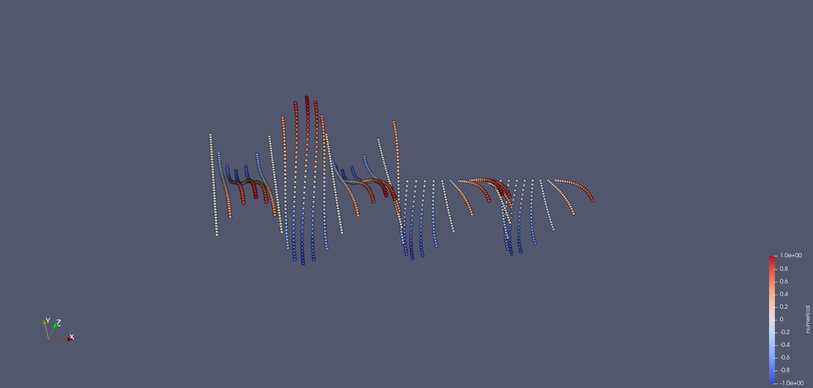

# Solving PDEs by collocation

Kernel methods are also suitable to solve partial differential equations (PDEs), which is also sometimes known as Hermite-Birkhoff
interpolation, a special case of generalized interpolation. In an abstract setting generalized interpolation deals with the following
problem: Given a Hilbert space $H$ and a set of functionals $\{\lambda_i\}_{i = 1}^N\subset H^*$ ($H^*$ being the dual space), find a
function $s\in H$ such that $\lambda_i(s) = f_i$ for $i = 1,\ldots,N$ for given function values $f_i$.
[Classical interpolation](@ref classical_interpolation), discussed in the previous section, corresponds to the case where $H$ is a
reproducing kernel Hilbert space (RKHS) and $\lambda_i(s) = s(x_i)$ are point evaluations at the nodes $x_i$ for $X = \{x_i\}_{i = 1}^N$.
In the case of Hermite-Birkhoff interpolation, the functionals $\lambda_i$ are not point evaluations but differential operators, which
are applied to the function $s$ and then evaluated at the nodes $x_i$.

The following is mostly based on the book by Fasshauer [^Fasshauer2015].

## Stationary PDEs

Consider the following general stationary PDE in a domain $\Omega\subset\mathbb{R}^d$:

```math
\mathcal{L}u = f,
```

where $\mathcal{L}$ is a linear differential operator of order $m$, $u$ is the unknown function and $f$ is a given function.
The operator $\mathcal{L}$ can be written as

```math
\mathcal{L}u = \sum_{|\alpha|\leq m} a_\alpha D^\alpha u,
```

where $D^\alpha = \partial_{x_1}^{\alpha_1}\cdots\partial_{x_d}^{\alpha_d}$ is a partial derivative of order
$|\alpha| = \alpha_1 + \cdots + \alpha_d$. Note that in the context of PDEs we usually use the notation $u$ for the
unknown function instead of $s$ as in the general interpolation problem. For a complete description of the PDE, we also
need to specify boundary conditions on the boundary $\partial\Omega$, which can be written with a boundary operator $\mathcal{B}$ as

```math
\mathcal{B}u = g,
```

where $g$ is a given function. As boundary operator $\mathcal{B}$ we usually consider the identity operator, which corresponds to
Dirichlet boundary conditions. Like in the case of classical interpolation, we pick a set of nodes $X_I = \{x_i\}_{i = 1}^{N_I}\subset\Omega$.
Due to the additional boundary conditions, we also pick a set of nodes $X_B = \{x_i\}_{i = N_I + 1}^N\subset\partial\Omega$.
Let $N = N_I + N_B$ and $X = X_I\cup X_B$. We again formulate an ansatz function $u$ as a linear combination of basis functions.
In the simplest case, we use the same linear combination (neglecting polynomial augmentation for simplicity), i.e.

```math
u(x) = \sum_{j = 1}^N c_jK(x, x_j),
```

where $K$ is the kernel function. This approach is also known as non-symmetric collocation or Kansa's method. By enforcing the
conditions $\mathcal{L}u(x_i) = f(x_i)$ for $i = 1,\ldots,N_I$ and $\mathcal{B}u(x_i) = g(x_i)$ for $i = N_I + 1,\ldots,N$ we
obtain a linear system of equations for the coefficients $c_i$, which can be written as

```math
\begin{pmatrix}
\tilde{A}_L \\ \tilde{A}_B
\end{pmatrix}
c = \begin{pmatrix}
f_{X_I} \\ g_{X_B}
\end{pmatrix},
```

where $\tilde{A}_L\in\mathbb{R}^{N_I\times N}$ and $\tilde{A}_B\in\mathbb{R}^{N_I\times N}$ are the matrices corresponding to
the conditions at the interior and boundary nodes, respectively, i.e.

```math
\begin{align*}
    (\tilde{A}_L)_{ij} &= \mathcal{L}K(x_i, x_j), i = 1, \ldots, N_I, j = 1, \ldots, N \\
    (\tilde{A}_B)_{ij} &= \mathcal{B}K(x_i, x_j), i = 1, \ldots, N_B, j = 1, \ldots, N.
\end{align*}
```

Since the kernel function is known and differentiable, we can compute the derivatives of $K$ analytically.

!!! note
    In KernelInterpolation.jl, the derivatives of the kernel function are computed using automatic differentiation (AD) by using
    [ForwardDiff.jl](https://github.com/JuliaDiff/ForwardDiff.jl). This allows for flexibility, simplicity, and easier extension,
    but it might be slower than computing the derivatives analytically. If you are interested in a more efficient implementation,
    you can have a look at the test set "Differential operators" in the
    [test suite of KernelInterpolation.jl](https://github.com/JoshuaLampert/KernelInterpolation.jl/blob/main/test/test_unit.jl).
    This test set not only shows how to use analytical derivatives, but also how to define your own differential operators,
    which can be used to define custom PDEs.

Note, however, that the system matrix $A = \begin{pmatrix} \tilde{A}_L \\ \tilde{A}_B \end{pmatrix}$ is not invertible in general
because it not symmetric anymore as it was the case in the classical interpolation. Thus, this approach is also called
non-symmetric collocation.

Let us see how this can be implemented in KernelInterpolation.jl by solving the Poisson equation ``-\Delta u = f`` in an L-shaped
domain. We start by defining the equation (thus the differential operator) and the right-hand side. KernelInterpolation.jl already
provides a set of predefined [differential operators](@ref api-diffops) and [equations](@ref api-equations).

```@example poisson
using KernelInterpolation

# right-hand-side of Poisson equation
f(x, equations) = 5 / 4 * pi^2 * sinpi(x[1]) * cospi(x[2] / 2)
pde = PoissonEquation(f)

# analytical solution of equation
u(x, equations) = sinpi(x[1]) * cospi(x[2] / 2)
```

Next, we define the domain and the boundary of the L-shaped domain. We use a homogeneous grid for the nodes and filter the inner
and boundary nodes in two separate [`NodeSet`](@ref)s.

```@example poisson
function create_L_shape(N)
    x_min1 = (0.0, 0.0)
    x_max1 = (1 * pi, 1.0)
    x_min2 = (1 * pi, 0.0)
    x_max2 = (2 * pi, 1.0)
    x_min3 = (0.0, 1.0)
    x_max3 = (1 * pi, 2.0)
    nodeset1 = homogeneous_hypercube(N, x_min1, x_max1)
    nodeset2 = homogeneous_hypercube(N, x_min2, x_max2)
    nodeset3 = homogeneous_hypercube(N, x_min3, x_max3)
    nodeset = merge(nodeset1, nodeset2, nodeset3)
    unique!(nodeset)
    nodeset_inner = empty_nodeset(2)
    nodeset_boundary = empty_nodeset(2)
    for x in nodeset
        if x[1] == 0.0 || x[2] == 0.0 || x[2] == 2.0 || x[1] == 2.0 * pi || (x[1] == 1.0 * pi && x[2] >= 1.0) || (x[2] == 1.0 && x[1] >= pi)
            push!(nodeset_boundary, x)
        else
            push!(nodeset_inner, x)
        end
    end
    return nodeset_inner, nodeset_boundary
end
nodeset_inner, nodeset_boundary = create_L_shape(6)
```

Finally, we define the boundary condition, the kernel, and collect all necessary information in a [`SpatialDiscretization`](@ref),
which can be solved by calling the [`solve_stationary`](@ref) function.

```@example poisson
# Dirichlet boundary condition (here taken from analytical solution)
g(x) = u(x, pde)

kernel = WendlandKernel{2}(3, shape_parameter = 0.3)
sd = SpatialDiscretization(pde, nodeset_inner, g, nodeset_boundary, kernel)
itp = solve_stationary(sd)
```

The result `itp` is an [`Interpolation`](@ref) object, which can be used to evaluate the solution at arbitrary points. We can
save the solution on a finer grid to a VTK file and visualize it.

```@example poisson
many_nodes_inner, many_nodes_boundary = create_L_shape(20)
many_nodes = merge(many_nodes_inner, many_nodes_boundary)
OUT = "out"
ispath(OUT) || mkpath(OUT)
vtk_save(joinpath(OUT, "poisson_2d_L_shape"), many_nodes, itp, x -> u(x, pde);
         keys = ["numerical", "analytical"])
rm(joinpath(OUT, "poisson_2d_L_shape.vtu")) #clean up again # hide
```

The resulting VTK file can be visualized with a tool like ParaView. After applying the filter `Warp by Scalar`, setting
the coloring accordingly, and changing the "Representation" to "Point Gaussian", we obtain the following visualization:



## Time-dependent PDEs

KernelInterpolation.jl also supports the solution of time-dependent PDEs. The idea is to use the same approach as above for
the spatial part of the PDE and then obtain an ordinary differential equation (ODE), which can be solved by some time
integration method (method of lines). The general form of a time-dependent PDE is

```math
\partial_t u + \mathcal{L}u = f,
```

where $\mathcal{L}$ is a linear differential operator of order $m$ and $f$ is a given function. The initial condition is
given by $u(x, 0) = u_0(x)$. Boundary conditions are applied as before. Similar to the stationary case, we discretize the
spatial part of the PDE by collocation and obtain a system of ODEs for the coefficients $c_j$ of the basis functions, i.e.
now the coefficients depend on time:

```math
u(t, x) = \sum_{j = 1}^N c_j(t)K(x, x_j),
```

where $c_j(t)$ are the coefficients at time $t$. We again divide the spatial domain in a set of points in the inner domain
$X_I$ and at the boundary $X_B$. Plugging in the ansatz function into the PDE and the boundary conditions and evaluating at
the nodes, we obtain the following system of ODEs and algebraic equations:

```math
\begin{align*}
    \partial_t u(t, x_i) &= \sum_{j = 1}^N \partial_t c_j(t)K(x_i, x_j) = -\sum_{j = 1}^Nc_j(t)\mathcal{L}K(x_i, x_j) + f(x_i), i = 1, \ldots, N_I, \\
    0 &= -\sum_{j = 1}^Nc_j(t)\mathcal{B}K(x_i, x_j) + g(x_i), i = N_I + 1, \ldots, N.
\end{align*}
```

These equations can be written compactly as a differential-algebraic equation (DAE) of the form

```math
Mc^\prime(t) = -Ac(t) + b
```

where $c(t) = [c_1(t), \ldots, c_N(t)]^T$ is the vector of coefficients, $M\in\mathbb{R}^{N\times N}$ is a (singular) mass
matrix, $A\in\mathbb{R}^{N\times N}$ is the system matrix, and $b = \begin{pmatrix}f_{X_I}\\ g_{X_B}\end{pmatrix}\in\mathbb{R}^N$.
The matrices are given by

```math
M = \begin{pmatrix} \tilde{A_I}\\0\end{pmatrix} \quad\text{and}\quad A = \begin{pmatrix} \tilde{A_L}\\\tilde{A_B}\end{pmatrix},
```

where

```math
\begin{align*}
    \tilde{A_I}\in\mathbb{R}^{N_I\times N}, (\tilde{A_I})_{ij} &= K(x_i, x_j),\\
    \tilde{A_L}\in\mathbb{R}^{N_I\times N}, (\tilde{A_L})_{ij} &= \mathcal{L}K(x_i, x_j),\\
    \tilde{A_B}\in\mathbb{R}^{N_B\times N}, (\tilde{A_B})_{ij} &= \mathcal{B}K(x_i, x_j).
\end{align*}
```

The coefficients for the initial conditions can be computed from the initial condition $u_0(x)$ by solving the linear system

```math
\begin{pmatrix}
\tilde{A_I}\\\tilde{A_B}
\end{pmatrix}
c_0 = (u_0)_X.
```

For the solution of the DAE system, KernelInterpolation.jl uses the library [OrdinaryDiffEq.jl](https://github.com/SciML/OrdinaryDiffEq.jl),
which already provides a wide range of time integration methods. Note that this is a differential-algebraic equation (DAE)
system, which is more difficult to solve than a simple ODE system. Thus, we are restricted to specialized time integration
methods, which can handle DAEs. We recommend using the `Rodas5P` method, which is a Rosenbrock method for stiff DAEs. See
also the [documentation of OrdinaryDiffEq.jl](https://docs.sciml.ai/DiffEqDocs/latest/tutorials/dae_example/) for more information.
`Rodas5P` along with other Rosenbrock methods are implemented in the subpackage OrdinaryDiffEqRosenbrock.jl. Therefore, we
recommend using this package in combination with KernelInterpolation.jl to reduce precompile time. In order to solve DAEs with
OrdinaryDiffEqRosenbrock.jl, we also need to import the subpackage OrdinaryDiffEqNonlinearSolve.jl.

In KernelInterpolation.jl, you can use the constructor of a [`Semidiscretization`](@ref) in a very similar way as
[`SpatialDiscretization`](@ref), but with the additional initial condition. This can be turned into an `ODEProblem` object
from the OrdinaryDiffEq.jl ecosystem by calling [`semidiscretize`](@ref). The resulting `ODEProblem` can then be solved by calling
the [`solve`](https://docs.sciml.ai/DiffEqDocs/latest/basics/common_solver_opts/) function from OrdinaryDiffEq.jl. The resulting object
is an `ODESolution` object, which can be transferred to a [`TemporalInterpolation`](@ref) by calling `TemporalInterpolation` on it.
This object acts similarly to an [`Interpolation`](@ref), but has an additional time argument, e.g., `itp = titp(1.0)` gives an
interpolation object `itp` from a temporal interpolation `titp` at time `t = 1.0`.

For a complete example of a time-dependent PDE, see, e.g.,
[an example of the heat equation](https://github.com/JoshuaLampert/KernelInterpolation.jl/blob/main/examples/PDEs/heat_2d_basic.jl).
KernelInterpolation.jl provides [some callbacks](@ref api-callbacks) that are can be passed to `solve` in order to call them during
the time integration process. These can be used to monitor the solution or to save it to a file. To date, these are [`AliveCallback`](@ref),
[`SaveSolutionCallback`](@ref), and [`SummaryCallback`](@ref).

## References

[^Fasshauer2015]:
    Fasshauer (2015):
    Kernel-based Approximation Methods using MATLAB,
    World Scientific,
    [DOI: 10.1142/9335](https://doi.org/10.1142/9335).
